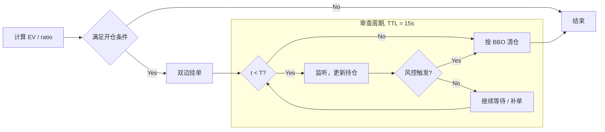

# Queue Aware Market Maker

## 做市商逻辑

设做市商在终点时刻 $T$ 的现金头寸为 $X_T$，库存为 $q_T$，则其终端财富为

$$
W_T = X_T + q_T S_T.
$$

使用指数效用函数

$$
U(W) = -e^{-\gamma W}
$$

其中 $\gamma>0$ 为风险厌恶系数。于是做市商的目标写为

$$
\max_{\delta^{bid},\,\delta^{ask}}
\mathbb E_t\!\left[-e^{-\gamma (X_T + q_T S_T)}\right].
$$

这个目标函数的经济含义是：做市商不仅关心期望收益，还关心库存暴露在价格波动下带来的风险；$\gamma$ 越大，越不愿意承受库存风险。

## 最优报价模型

### 基本设定

设中间价 $S_t$ 服从无漂移扩散过程：

$$
dS_t = \sigma\, dW_t,
$$

其中 $\sigma$ 表示 mid-price 波动率。

做市商在时刻 $t$ 报出买卖双边限价单，并令其相对 mid 的偏移分别为

$$
\delta_t^{bid}, \qquad \delta_t^{ask}.
$$

于是报价写为

$$
p_t^{bid} = S_t - \delta_t^{bid},
\qquad
p_t^{ask} = S_t + \delta_t^{ask}.
$$

模型假设限价单的成交到达强度随报价距离增大而指数衰减，即

$$
\lambda^{bid}(\delta)=A e^{-k\delta},
\qquad
\lambda^{ask}(\delta)=A e^{-k\delta},
$$

其中：

- $A$ 是基准成交强度；
- $k$ 描述成交强度对报价距离的敏感性；
- $k$ 越大，说明订单越容易成交，市场流动性越好。

### Avellaneda-Stoikov

> Avellaneda-Stoikov (2008) 模型的核心问题是在给定波动率、风险厌恶和成交强度的条件下，求解做市商应当将 bid / ask 报在距离 mid 多远的位置，从而在成交收益与库存风险之间取得最优权衡。

该优化问题的解在经典的 Avellaneda-Stoikov 模型下可以理解为两个部分的叠加，其简化形式如下:

$$
\delta^{bid}=\delta^{ask}
=
\gamma \sigma^2 (T-t)
+
\frac{1}{\gamma}\ln\!\left(1+\frac{\gamma}{k}\right),
$$

**(i) 库存风险补偿**

若做市商在剩余时间 $T-t$ 内持有库存，则中间价波动会带来风险。由于

$$
\mathrm{Var}(S_T-S_t)=\sigma^2(T-t),
$$

因此库存风险补偿项自然与

$$
\gamma \sigma^2 (T-t)
$$

同阶。它表示：波动率越高、剩余时间越长、风险厌恶越强，则报价应离 mid 更远，以补偿持仓风险。

**(ii) 成交收益与成交概率的权衡**

若报价离 mid 越远，则单笔成交收益更高；但成交强度

$$
\lambda(\delta)=A e^{-k\delta}
$$

会下降。于是做市商需要在”报得更宽赚更多”和”报得更近更容易成交”之间做权衡。对该权衡求最优，可得到典型的流动性补偿项

$$
\frac{1}{\gamma}\ln\!\left(1+\frac{\gamma}{k}\right).
$$

该项的直觉是：

- 当 $k$ 很大时，市场流动性好，做市商不必报得太宽；
- 当 $\gamma$ 很小时，做市商更接近风险中性，更关注成交收益与成交频率之间的静态平衡。

### 模型拓展

经典 Avellaneda-Stoikov 模型假设 mid-price 服从无漂移扩散过程。然而在真实市场中，mid-price 往往并非纯粹的无方向随机游走，而可能表现出短期均值回复或局部漂移特征。因此，原始模型通常需要作进一步拓展。

#### 1. 均值回复

若市场中价格存在短期均值回复，则可将 mid-price 建模为 Ornstein-Uhlenbeck 型过程：

$$
dS_t = \kappa (m - S_t)\,dt + \sigma\,dW_t,
$$
其中：

- $m$ 表示局部均值水平；
- $\kappa > 0$ 表示回复速度；
- $\sigma$ 表示随机扰动强度。

该模型的经济含义是：当价格偏离局部均值时，会受到一个指向均值的回复力。对于做市商而言，这意味着单侧持仓后的价格风险小于纯布朗运动假设下的风险，因此最优报价通常会相对收窄。换言之，在存在短期均值回复时，原始 A-S 模型往往会高估库存风险，从而给出偏宽的最优 spread。

#### 2. 漂移项

若市场存在短期方向性信息，可将 mid-price 写为

$$
dS_t = \mu_t\,dt + \sigma\,dW_t,
$$

其中 $\mu_t$ 为条件漂移项。

此时，最优报价通常不再围绕当前 mid 对称展开，而会根据 $\mu_t$ 的方向产生偏移。因而，漂移项的主要影响在于改变报价中心并引入方向性 skew，而非仅仅改变 spread 的宽度。

在成交模型层面的漂移优化可以看 [[优化] BBO 微漂移打靶](##[优化] BBO 微漂移打靶)

## 双边挂单策略

利用做市商通过同时在买卖两侧挂限价单赚取价差(spread)。

| outcome  | $P_i$                | $\text{PnL}$                      |
| -------- | -------------------- | --------------------------------- |
| Both     | $p_{\text{both}}$    | $spread - C^{AS}_{\mathrm{both}}$ |
| Bid Only | $p_{\text{bid}}$     | $-C^{AS}_{\mathrm{bid}} - C_0$    |
| Ask Only | $p_{\text{ask}}$     | $-C^{AS}_{\mathrm{ask}} - C_0$    |
| Neither  | $p_{\text{neither}}$ | $-C_0$                            |

> $p_{\mathrm{both}} + p_{\mathrm{bid}} + p_{\mathrm{ask}} + p_{\mathrm{neither}} = 1$

Where **开仓期望成本** $EV$:

$$
EV = \sum_{i \in  \text{outcome}} p_i \cdot \text{PnL}_i
$$

### 风险来源

1. **逆向选择(Adverse Selection):** 限价单成交后后，价格向不利方向移动
2. **单侧暴露(Single-sided Exposure):** 只有一侧成交，持仓暴露在市场风险中

### P&L 口径

| 符号                            | 含义                            | P&L 口径                                             |
| ------------------------------- | ------------------------------- | ---------------------------------------------------- |
| $spread$                        | 当前 bid--ask spread            | 毛收益项，不属于成本                                 |
| $C^{AS}_{\mathrm{both}}$        | 双侧成交时的逆向选择成本        | 在双侧均成交条件下的总逆向选择成本                   |
| $C^{AS}_{\mathrm{\{bid,ask\}}}$ | 单侧成交时的逆向选择成本        | 在恰有一侧成交条件下，由该成交侧承担的总逆向选择成本 |
| $C_0$                           | 等待成本（资金占用 + 机会成本） | 每轮报价固定产生，无论是否发生任何成交               |

针对敞口我们可以得到以下排序

$$
w \ll C^{AS}_{\text{both}} \lesssim C^{AS}_{\text{\{bid, ask\}}} \lll 单侧暴露
$$

### 概率计算

Let:

- $P_{\mathrm{Bid}}$：bid 单成交的边缘概率
- $P_{\mathrm{Ask}}$：ask 单成交的边缘概率

则四种 outcome 的概率满足恒等式:

$$
\left\{
\begin{aligned}
P_{\mathrm{Bid}} &= p_{\mathrm{both}} + p_{\mathrm{bid}} \\
P_{\mathrm{Ask}} &= p_{\mathrm{both}} + p_{\mathrm{ask}} \\
p_{\mathrm{neither}} &= 1 - p_{\mathrm{bid}} - p_{\mathrm{ask}} + p_{\mathrm{both}}
\end{aligned}
\right.
$$

**在 Bid 与 Ask 成交独立假设下**

If Bid and Ask fills are independent, then:

$$
\left\{
\begin{aligned}
p_{\mathrm{both}} &= P_{\mathrm{Bid}} \, P_{\mathrm{Ask}} \\
p_{\mathrm{bid}} &= P_{\mathrm{Bid}}(1 - P_{\mathrm{Ask}}) \\
p_{\mathrm{ask}} &= (1 - P_{\mathrm{Bid}}) P_{\mathrm{Ask}} \\
p_{\mathrm{neither}} &= (1 - P_{\mathrm{Bid}})(1 - P_{\mathrm{Ask}})
\end{aligned}
\right.
$$

## Queue Aware 模型

假设订单是 TOC, 那么他的成交结果只能是 $\{\text{filled}, \text{cancelled}\}$ 纵然将问题简化成一个二分类

### I. 静态成交概率

基于 FIFO 类型的撮合引擎, 我们可以认为一笔订单成交的概率**极大程度**依赖他在当前价位上队列的相对位置 

$$
\tilde{q_t} = \frac{q_t^{\text{ahead}}}{m_t}
$$

其中:

- $q_t^{\text{ahead}}$ 是挂单时在队列中的位置
- $m_t = \text{EWMA}(q_t^{\text{ahead}})$ 是归一化系数

根据贝叶斯分类器 + GED分布可以描述订单成交的概率为:

$$
P(\text{filled} \ | \ \tilde q) = \frac{\pi \cdot f_{GED}^{\text{filled}}(\tilde{q_t})}
{\pi \cdot f_{GED}^{\text{filled}}(\tilde{q_t}) \ + \ (1 - \pi) \cdot f_{GED}^{\text{cancelled}}(\tilde{q_t})}
$$

其中:

- $\pi$ 是先验的成交率

### II. 速率修正逻辑

显然易见, 队列的消耗速度也会影响订单成交的概率。记当前挂单所在价位的总队列深度为 $Q_t$，定义其相对变化率的指数加权平均为

$$
v_t = \operatorname{EWMA}\!\left(\frac{dQ_t}{Q_t}, \alpha_v = 0.05\right)
$$

其中：

- $Q_t$ 表示当前价位上的总挂单深度
- $\frac{dQ_t}{Q_t}$ 表示队列深度的相对变化率
- $\alpha_v$ 为平滑系数

其经济含义为：

- $v_t < 0$：队列正在消耗，说明排在前面的挂单被不断成交或撤单，本单更接近成交
- $v_t > 0$：队列正在堆积，说明前方不断有新增挂单或补单，本单更难成交

**修正函数**

为了将队列动态引入静态成交概率模型，定义修正因子：

$$
\text{adj}_t = 1 - \beta \tanh(\gamma v_t)
$$

其中：

- $\beta \in (0,1)$ 控制修正幅度
- $\gamma > 0$ 控制对 $v_t$ 的敏感度

在本文设定中，取

$$
\beta = 0.2, \qquad \gamma = 5.0
$$
于是有

$$
\text{adj}_t = 1 - 0.2 \tanh(5 v_t)
$$

由于 $\tanh(x)\in(-1,1)$，故修正因子始终满足

$$
\text{adj}_t \in (0.8,\,1.2)
$$
因此该修正是**有界的**，不会导致成交概率被过度放大或压缩。

### 修正后的成交概率

最终成交概率定义为

$$
P_{\text{final}}(\text{filled}\mid \tilde q_t, v_t)
=
\min\!\left\{
1,\;
P_{\text{base}}(\text{filled}\mid \tilde q_t)\cdot \text{adj}_t
\right\}
$$

其中加入 $\min\{1,\cdot\}$ 是为了保证概率始终落在 $[0,1]$ 内。

### 小样本冷启动

> 在 GED 尚未完成可靠拟合的冷启动阶段，为避免在小样本条件下施加过强的参数分布假设，这里采用基于局部邻域的 KNN–Beta 后验修正，以构造成交概率的保守估计。

设真实的局部成交概率为

$$
p^*(\tilde q_t) := P(\mathrm{filled}\mid \tilde q_t).
$$

对于当前相对队列位置 $\tilde q_t$，取其 $k$ 个最近邻样本构成局部邻域 $\mathcal N_k(\tilde q_t)$，并记其中成交样本数为

$$
s_t := \sum_{i\in \mathcal N_k(\tilde q_t)} \mathbf 1\{y_i=1\}.
$$

令局部成交概率参数为 $\theta_t$。若赋予其 Beta 先验

$$
\theta_t \sim \mathrm{Beta}(\alpha,\beta),
$$
则在观测到局部邻域样本后，其后验分布为

$$
\theta_t \mid \mathcal N_k(\tilde q_t)
\sim
\mathrm{Beta}(\alpha+s_t,\;\beta+k-s_t).
$$

为获得保守的冷启动估计，定义

$$
P^{\mathrm{cold}}_{\mathrm{fill}}(\tilde q_t)
:=
Q_{\eta}\!\left(\mathrm{Beta}(\alpha+s_t,\;\beta+k-s_t)\right),
\qquad 0<\eta<\tfrac12,
$$

其中 $Q_{\eta}$ 表示后验分布的 $\eta$ 分位数。于是有

$$
\Pr\!\left(
\theta_t \ge P^{\mathrm{cold}}_{\mathrm{fill}}(\tilde q_t)
\,\middle|\,
\mathcal N_k(\tilde q_t)
\right)
=
1-\eta,
$$

因此，$P^{\mathrm{cold}}_{\mathrm{fill}}(\tilde q_t)$ 可解释为局部成交概率的一个保守下可信界（lower credible bound）。

进一步地，在标准 KNN 渐近条件

$$
k=k_n\to\infty,
\qquad
\frac{k_n}{n}\to 0
$$

下，该估计依概率收敛到真实局部成交概率，即

$$
P^{\mathrm{cold}}_{\mathrm{fill}}(\tilde q_t)
\overset{p}{\longrightarrow}
p^*(\tilde q_t).
$$

## 敞口管理

### I. 开仓约束

当盘口处于不平衡状态时更容易产生**单侧暴露**，定义盘口的平衡度为 $ratio \in [0, 1]$，且应满足对方向中性。则开仓约束可以定义为 $ratio \ge \theta$。

e.g.

$$
ratio = \frac{\min(P_{bid}, P_{ask})}{\max(P_{bid}, P_{ask})}
$$

### II. 持仓生命周期

简化周期示意图

### TTL 审查局限性

## [优化] BBO 微漂移打靶

当检测到 bid 即将上移 1 tick 时，预判性地将 sell 挂在 `ask + 1 tick`, 设订单漂移概率为 $P_{drift}$

## [优化] 订单簿状态空间

在高频做市场景下，price impact 会直接改变订单簿的可见结构，从而影响后续成交概率、订单流反应与价格路径。因此，若仍将订单簿视为静态且外生的环境，回测往往会系统性高估策略表现。

为缓解这一问题，本系统引入盘口状态模型，通过构建订单簿的状态转移空间，估计下单行为对后续盘口更新的影响，并对做市逻辑中的成交概率、挂单有效性与风险评估进行粗颗粒度修正。

### Markov 型订单簿模型

**状态空间**

简单的，我们将订单簿表示为一个随机状态过程 $X_t$。在最简的 top-of-book 情形下，可写为

$$
X_t = (q_t^b, q_t^a, p_t),
$$

其中：

- $q_t^b$：最优买价上的队列长度
- $q_t^a$：最优卖价上的队列长度
- $p_t$：参考价格或中间价

也可以根据实际情况扩展状态空间。

Markov LOB 的基本假设是，订单簿状态满足 Markov property：

$$
\mathbb{P}(X_{t+\Delta t}\mid \mathcal{F}_t)
=
\mathbb{P}(X_{t+\Delta t}\mid X_t),
$$

也就是说，在给定当前订单簿状态 $X_t$ 后，未来的状态演化不再额外依赖更早的历史路径。

**订单簿事件**

设事件类型 $\ell \in \{\mathrm{L}_i, \mathrm{C}_i, \mathrm{M}_i\}$，分别表示在第 $i$ 档位：

- $\mathrm{L}_i$：限价单到达（limit order arrival）
- $\mathrm{C}_i$：撤单（cancellation）
- $\mathrm{M}_i$：市价单成交/吃单（market order execution）

因此，订单簿的状态转义可以被建模为一个 Markov jump process:

$$
X_t \;\to\; X_t + v_\ell
\qquad \text{with intensity } \lambda_\ell(X_t),
$$

其中：

- $v_\ell$：第 $\ell$ 类事件对订单簿状态的增量
- $\lambda_\ell(X_t)$：在当前状态 $X_t$ 下，该事件发生的条件强度

**价格跳动机制**

当某一侧队列耗尽时:

- 若 $q_t^a=0$，则价格上跳

$$
(q_t^b,q_t^a,p_t)\to(\tilde q_t^b,\tilde q_t^a,p_t+\delta)
\quad \text{if } q_t^a=0
$$

- 若 $q_t^b=0$，则价格下跳

$$
(q_t^b,q_t^a,p_t)\to(\tilde q_t^b,\tilde q_t^a,p_t-\delta)
\quad \text{if } q_t^b=0
$$

其中 $\delta$ 是 tick size，$(\tilde q_t^b,\tilde q_t^a)$ 是价格跳动后的新顶层队列。

#### Queue-reactive 模型

在 Markov LOB 的框架下，queue-reactive 模型进一步假设订单簿中各类事件的到达强度由当前 queue 状态决定。

则第 $\ell$ 类事件在时刻 $t$ 在 Queue-reactive 模型下发生的强度写为

$$
\lambda_\ell(t) = f_\ell(X_t).
$$

**状态转移概率**

通过统计获取先验 $\hat\lambda_\ell(x)$ 可以得到事件发生的总强度是

$$
\Lambda(x)=\sum_\ell \hat\lambda_\ell(x)
$$

于是，在状态 $x$ 下：

- 下一次事件等待时间服从指数分布

$$
\tau \sim \mathrm{Exp}(\Lambda(x))
$$

- 下一次事件是 $\ell$ 的条件概率为

$$
P(\text{next event}=\ell\mid X_t=x)=\frac{\hat\lambda_\ell(x)}{\Lambda(x)}
$$

#### Hawkes 模型

相较于 Markov 型订单簿模型仅依赖当前状态 $X_t$，Hawkes 模型进一步考虑历史事件流对未来事件强度的影响。其核心思想是：订单流并非独立到达，而具有显著的自激发（self-excitation）与互激发（mutual-excitation）特征，即一次限价单到达、撤单或市价单成交，可能在短时间内提高后续同类或异类事件继续发生的概率。

设事件类型 $\ell\in\mathcal E$，则第 $\ell$ 类事件在时刻 $t$ 的条件强度可写为

$$
\lambda_\ell(t)
=
\mu_\ell
+
\sum_{m\in\mathcal E}
\int_0^t \phi_{\ell m}(t-s)\, dN_m(s),
$$

其中：

- $\mu_\ell$：第 $\ell$ 类事件的基准强度；
- $N_m(s)$：第 $m$ 类事件的计数过程；
- $\phi_{\ell m}(\cdot)$：激发核函数，描述过去第 $m$ 类事件对当前第 $\ell$ 类事件强度的影响。

若采用指数核，则常写为

$$
\phi_{\ell m}(u)=\alpha_{\ell m} e^{-\beta_{\ell m}u}\mathbf 1_{\{u>0\}},
$$

其中 $\alpha_{\ell m}$ 控制激发强度，$\beta_{\ell m}$ 控制影响衰减速度。

因此，Hawkes 模型的主要作用在于刻画：

- 事件到达的时间聚集性；
- 买卖单流之间的相互影响；
- 价格跳动与订单流之间的动态反馈。

从做市角度看，Hawkes 模型并不直接预测未来每一笔具体订单，而是给出“在当前历史条件下，下一类事件更可能以多大强度发生”的条件分布，从而可用于修正成交概率、逆向选择风险与短时价格跳动概率。

#### Queue-reactive Hawkes 扩展

在更一般的情形下，可将当前盘口状态与历史事件流同时纳入条件强度，从而得到 queue-reactive Hawkes 模型：

$$
\lambda_\ell(t)
=
f_\ell(X_t)
+
\sum_{m\in\mathcal E}
\int_0^t \phi_{\ell m}(t-s)\, dN_m(s).
$$

其中第一项 $f_\ell(X_t)$ 描述当前 queue 状态对事件强度的影响，第二项描述历史事件流的自激发与互激发效应。这样，模型既保留了 queue-reactive 对盘口状态的敏感性，又补充了 Hawkes 对订单流时间聚集性的刻画。已有研究正是沿这一方向，将 queue size dependence 与 Hawkes 结构结合起来建模订单簿演化。

### 逆向选择成本估计

在静态分析中，逆向选择成本通常被简化为给定的固定常数。这种处理便于计算，但也会忽略盘口状态、订单流结构以及本方动作对成交后价格路径的影响。

更一般地，可以将逆向选择理解为：在当前盘口状态下执行某一动作后，若订单成交，则成交后的价格路径继续朝不利方向演化所带来的条件损失。在这一意义下，盘口状态模型可被用作一个条件估计框架，用于近似刻画逆向选择影响，并据此筛选出明显存在 adverse selection 风险的市场状态，而不必将逆向选择成本始终视为给定的固定常数。

设当前盘口状态为 $X_t$ 本方动作为 $a_t$ 则动作执行后的盘口状态记为

$$
X_t' = \Phi(X_t,a_t).
$$

此后，订单簿在事件集合 $\mathcal E$ 上按条件强度

$$
\lambda_e(X), \qquad e\in\ell
$$

发生随机跳跃，从而生成未来状态路径。

若订单在时刻 $\tau_{\mathrm{fill}}$ 成交，并在成交后观察窗口 $\Delta$ 上度量 adverse move，则定义成交后的不利价格损失为：

- 对买单，

$$
L^{AS}_{\mathrm{bid}}
=
\bigl(S_{\tau_{\mathrm{fill}}}-S_{\tau_{\mathrm{fill}}+\Delta}\bigr)^+
$$

- 对卖单，

$$
L^{AS}_{\mathrm{ask}}
=
\bigl(S_{\tau_{\mathrm{fill}}+\Delta}-S_{\tau_{\mathrm{fill}}}\bigr)^+
$$

据此，单侧成交情形下的逆向选择成本可定义为

$$
C^{AS}_{\mathrm{bid}}(X_t,a_t)
=
\mathbb E\!\left[
L^{AS}_{\mathrm{bid}}
\mid X_t,\;a_t,\;\tau_{\mathrm{fill}}<\infty
\right],
$$

$$
C^{AS}_{\mathrm{ask}}(X_t,a_t)
=
\mathbb E\!\left[
L^{AS}_{\mathrm{ask}}
\mid X_t,\;a_t,\;\tau_{\mathrm{fill}}<\infty
\right].
$$

若进一步考虑双侧均成交的情形，则可定义总逆向选择成本为

$$
C^{AS}_{\mathrm{both}}(X_t,a_t)
=
\mathbb E\!\left[
L^{AS}_{\mathrm{bid}} + L^{AS}_{\mathrm{ask}}
\mid X_t,\;a_t,\;\text{both fills}
\right].
$$

因此，在状态转移框架下，逆向选择成本不再是外生给定的常数，而是由当前盘口状态、执行动作以及未来状态演化共同决定的条件期望损失。原有做市逻辑中的固定逆向选择项，因而可被替换为状态条件形式：

$$
C^{AS}_{\mathrm{both}}
\;\longrightarrow\;
C^{AS}_{\mathrm{both}}(X_t,a_t),
$$

$$
C^{AS}_{\mathrm{bid}}
\;\longrightarrow\;
C^{AS}_{\mathrm{bid}}(X_t,a_t),
\qquad
C^{AS}_{\mathrm{ask}}
\;\longrightarrow\;
C^{AS}_{\mathrm{ask}}(X_t,a_t).
$$

在此基础上，期望收益也应相应改写为状态—动作条件形式：

$$
EV(X_t,a_t)
=
\sum_{i\in\text{outcome}}
P(i\mid X_t,a_t)\cdot \text{PnL}_i(X_t,a_t)
$$
